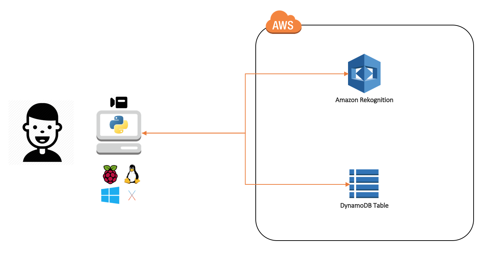

# Facer - Simple face recognition with Amazon Rekogntion

Simple face recognition with Amazon Rekogntion.

## Installation
1. Clone this repo.
2. Install `python`, `pip`, and `virtualenv` (if you don't already have them).
3. Change into the `facer` directory and create a virtualenv: `$ cd facer && virtualenv venv`
4. Activate the virtualenv: `$ . venv/bin/activate`
5. Run the setup utility: `$ pip install --editable .`
6. View the help: `$ facer --help`

## Overview



### Setup

```
$ facer setup --collection my_collection --path /path/to/images

```

1. Creates a DynamoDB table called *'my_collection'*.
2. Creates a [Rekognition collection](http://docs.aws.amazon.com/rekognition/latest/dg/howitworks-collection.html) called *'my_collection'*.
3. For each image in `/path/to/images`, adds the image to the collection. Also adds the face ID and name (the file name) to the DynamoDB table.

### Add a new face

```
$ facer add --name John Doe --collection my_collection

```

1. Grabs a frame from the camera and saves it to a temp file.
2. Adds the captured image to the collection *'my_collection'*. Also adds the face ID and name (*'John Doe'*) to the DynamoDB table.


### Recognize a face

```
$ facer capture --collection my_collection

```

1. Grabs a frame from the camera and saves it to a temp file
2. Compares the captured image to the faces in the collection *'my_collection'* and checks if a match is found.

## Contributing

Please [create a new GitHub issue](https://github.com/dstroppa/facer/issues/new) for any feature requests, bugs, or documentation improvements.

Where possible, please also [submit a pull request](https://help.github.com/articles/creating-a-pull-request-from-a-fork/) for the change.

## License

Licensed under the Apache License, Version 2.0 (the "License"). You may not use this file except in compliance with the License. A copy of the License is located at

[https://www.apache.org/licenses/LICENSE-2.0](https://www.apache.org/licenses/LICENSE-2.0)

or in the "license" file accompanying this file. This file is distributed on an "AS IS" BASIS, WITHOUT WARRANTIES OR CONDITIONS OF ANY KIND, either express or implied. See the License for the specific language governing permissions and limitations under the License.
